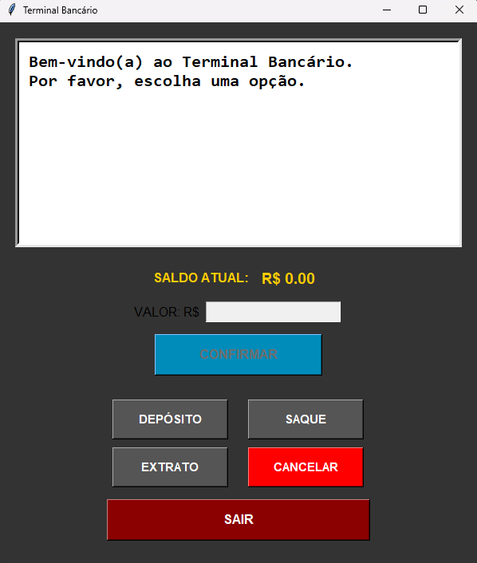

# Sistema Bancário com Interface Gráfica do Usuário

# 💳 Simulador de Caixa Eletrônico (ATM) com Interface Gráfica

Este é um projeto em Python que simula um terminal bancário (caixa eletrônico) com **interface gráfica interativa** e **efeitos sonoros**, utilizando as bibliotecas **Tkinter** e **Pygame**.

---

## 🖼️ Layout Visual

Abaixo está uma visualização do aplicativo em funcionamento:



---

## 🧩 Funcionalidades

- 🧾 **Depósito**: Adiciona valores à conta com validação.
- 💸 **Saque**: Permite até 3 saques por dia, com limite de R$ 500 por operação.
- 📑 **Extrato**: Exibe o histórico das transações realizadas.
- 🔊 **Sons personalizados** para ações (depósito, saque, erro, saída).
- ❌ **Cancelar**: Aborta a operação atual.
- 🔁 **Confirmação de valores** e feedback via mensagens na interface.
- 🚪 **Sair**: Encerra o terminal com som de desligamento (se disponível).

---

## ⚙️ Requisitos

- Python 3.7+
- Bibliotecas:
  - `pygame`
  - `tkinter` (incluso por padrão)

### Instalação de dependências

```bash
pip install pygame
